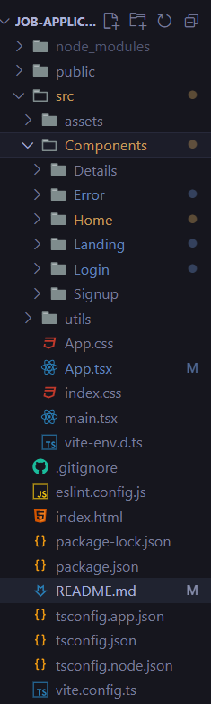
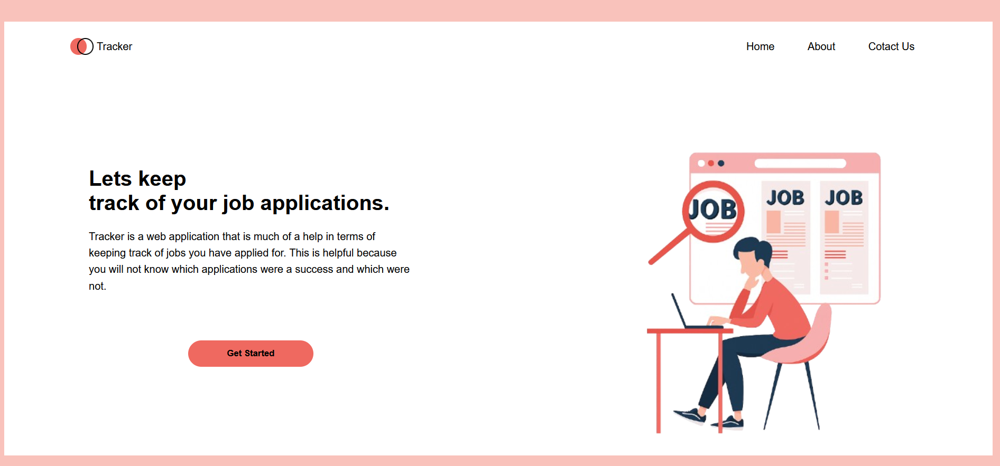
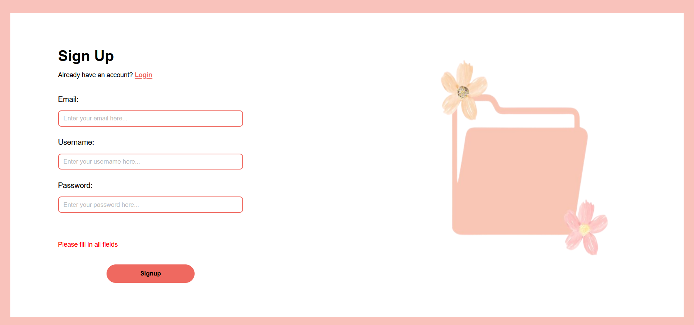
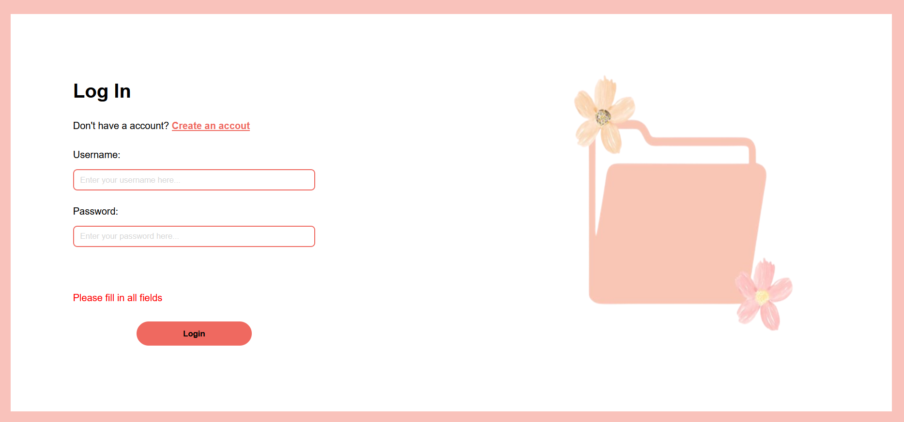
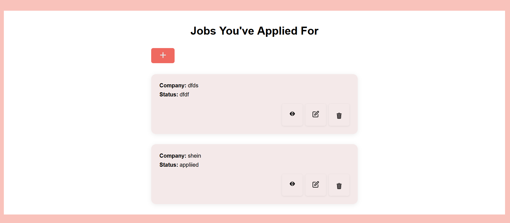
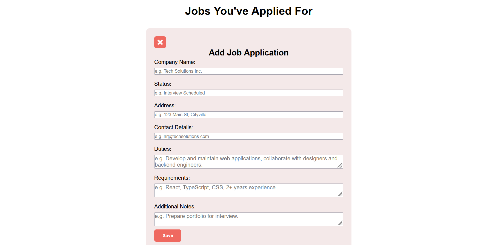
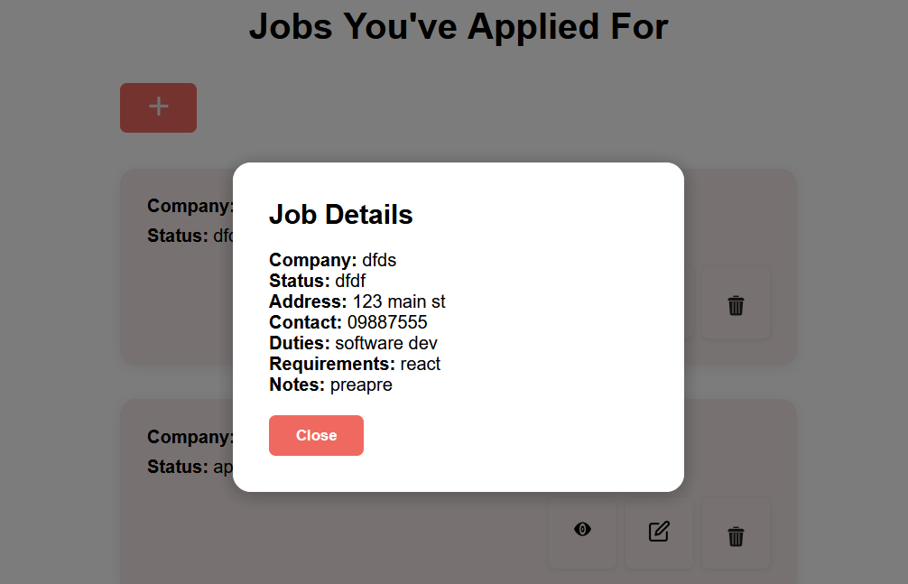
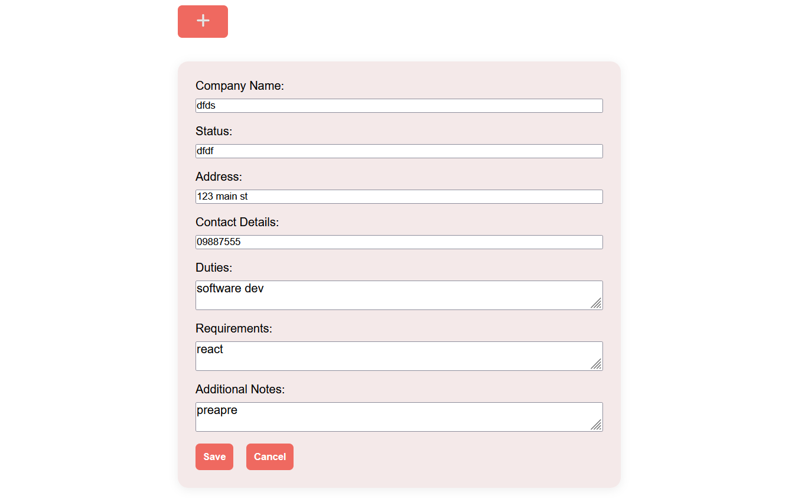
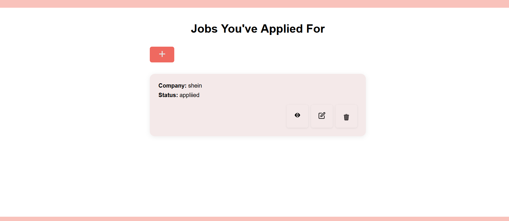

# Job Application Tracker  

A simple React-based application to help you track your job applications. You can add new applications, view details, and manage your progress — all in one place.  

-----------------------------------------------------------------------------------------------------------------------------------------------

## Features  
-  Add new job applications (company, role, status, etc.)  
-  View all applications in a structured list  
-  View detailed information about each application  
-  Cancel/close forms with a clickable icon button  
-  Smooth navigation between pages (Landing → Add Form → Details)  

-----------------------------------------------------------------------------------------------------------------------------------------------

##  Tech Stack  
- **React** (Frontend library)  
- **React Router** (Page navigation)  
- **Hooks (useState, useEffect)** for state management  
- **CSS Modules / Custom Styles** for styling  

-----------------------------------------------------------------------------------------------------------------------------------------------

## Project Structure  

  

-----------------------------------------------------------------------------------------------------------------------------------------------

##  Installation & Setup   
---in your terminal:

1. **Clone the repo** 

git clone https://github.com/your-username/job-application-tracker.git
cd job-application-tracker

2. **Install dependencies**
npm install

3. **Start the development server**
npm run dev

4. Open in your browser → http://localhost:  (Using the provided url)

## Project Outcome

 
 

 
  
 
 
 

